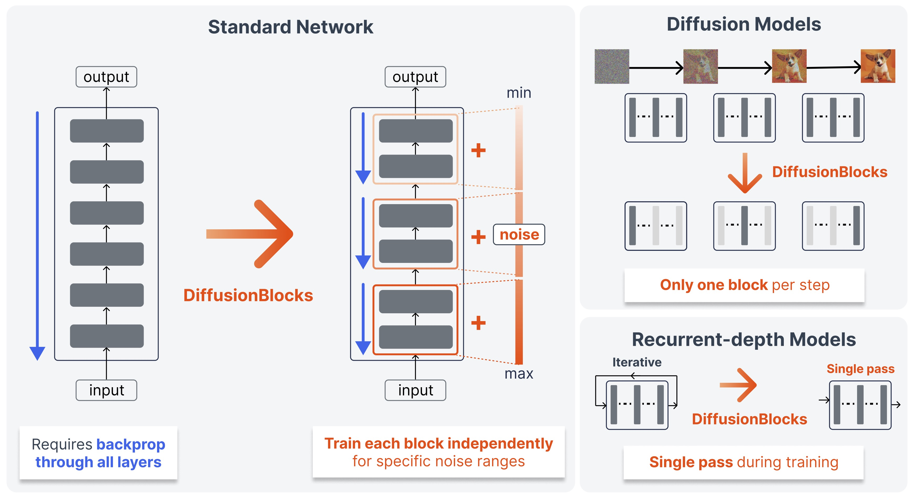

# DiffusionBlocks (ICLR 2026)

<div align="center">

</div>

> We propose ***DiffusionBlocks***, a principled framework that partitions transformers into independently trainable blocks, reducing memory requirements proportionally while maintaining competitive performance across diverse architectures and tasks.

This is an official implementation of *[DiffusionBlocks](https://arxiv.org/abs/2506.14202)* on image classification using Vision Transformers (ViT).

## Installation

Please install [uv](https://docs.astral.sh/uv/getting-started/installation/). Then, run:

```bash
# Install dependencies
uv sync

# make sure to login huggingface and wandb
uv run huggingface-cli login
uv run wandb login
```

We conducted our experiments in the following environment: Python Version 3.12 and CUDA Version 12.2 H100.

## Training

The model checkpoints are saved in `logs` folder.

**Baseline (ViT):**

```bash
uv run main.py train cifar100 --model_type vit
```

**DiffusionBlocks:**

```bash
uv run main.py train cifar100 --model_type dblock
```

* **NOTE:** the total epochs in DiffusionBlocks is multiplied by the number of blocks to align the total number of iterations with the baseline as one step in DiffusionBlocks corresponds to training for one block.

<details>

In the base setting, we don't reply on techniques such as heavy data augmentation. In case you want to see the performance with heavy data augmentation and learning rate scheduler, run as follows:

**Baseline (ViT):**

```bash
BATCH_SIZE=128
EPOCHS=1000
POSTFIX="-rand-augment"
WARMUP_STEPS=3900
MODEL_TYPE="dblock"
srun uv run main.py train cifar100 \
    --model_type $MODEL_TYPE \
    --batch_size $BATCH_SIZE --num_epochs $EPOCHS --postfix=$POSTFIX \
    --scheduler_type cosine_with_min_lr --num_warmup_steps $WARMUP_STEPS --lr 5e-4 \
    --scheduler_specific_kwargs '{"min_lr": 5e-5}' \
    --add_rand_aug
```

**DiffusionBlocks:**

```bash
BATCH_SIZE=128
EPOCHS=1000
POSTFIX="-rand-augment"
WARMUP_STEPS=$((3900 * 3)) # 3 indicates the number of blocks
MODEL_TYPE="dblock"
srun uv run main.py train cifar100 \
    --model_type $MODEL_TYPE \
    --batch_size $BATCH_SIZE --num_epochs $EPOCHS --postfix=$POSTFIX \
    --scheduler_type cosine_with_min_lr --num_warmup_steps $WARMUP_STEPS --lr 5e-4 \
    --scheduler_specific_kwargs '{"min_lr": 5e-5}' \
    --add_rand_aug
```

</details>

## Evaluation

**Baseline (ViT):**

```bash
CKPT_PATH="logs/path-to-last.ckpt"
uv run main.py test cifar100 --model_type vit --ckpt_path $CKPT
```

**DiffusionBlocks:**

```bash
CKPT_PATH="logs/path-to-last.ckpt"
uv run main.py test cifar100 --model_type dblock --ckpt_path $CKPT
```

## Acknowledgement

The implementation of Vision Transformer in [vit.py](./vit.py) is based on [HuggingFace Transformers](https://github.com/huggingface/transformers). And, the implementation of EDM is based on [Stability-AI/generative-models](https://github.com/Stability-AI/generative-models).  
We are grateful for their work.

## Citation

To cite our work, please use the following BibTeX:

```bibtex
@inproceedings{shing2026diffusionblocks,
  title     = {DiffusionBlocks: Block-wise Neural Network Training via Diffusion Interpretation},
  author.   = {Makoto Shing and Masanori Koyama and Takuya Akiba},
  booktitle = {The Fourteenth International Conference on Learning Representations},
  year      = {2026},
  url       = {https://openreview.net/forum?id=pwVSmK71cS}
}
```
